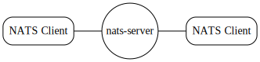
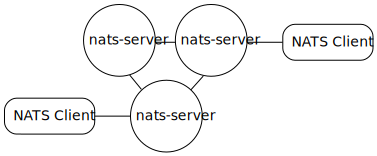
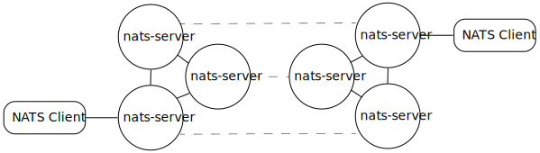
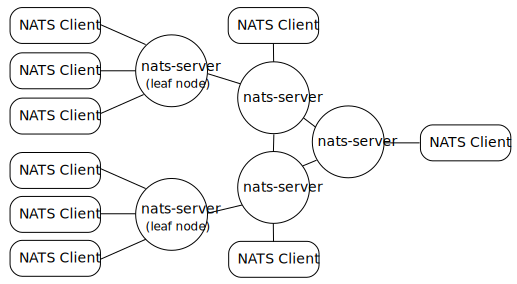

# NATS 自适应部署架构
从单个进程到具有叶节点服务器的全局超级集群，您总是可以根据需要调整您的NATS服务部署。从许多云中的服务器和vpc，到部分连接的小型边缘设备以及介于两者之间的所有设备，在随着需求的增长，总是可以轻松地扩展和扩展你的NATS服务。  

## 单台服务器
NATS服务基础结构的最简单版本是一个单一的`nat-server`进程。`nat-server`二进制文件经过了高度优化，非常轻量级，并且在资源使用方面非常高效。  

客户端应用程序建立到nat-server进程的URL的连接。(`nats://localhost`)。  

## 服务器集群
如果您需要一个容错的NATS服务，或者您需要扩展您的服务数量，您可以将一组nat-server进程聚集在一个集群中。  

客户端应用程序建立和维护一个连接到组成集群的nats服务器URL(例如:“nats://server1”、“nats://server2”,……)。  

## 超级集群
通过部署多个集群，并通过网关连接将它们连接在一起，您可以在单个集群之外进行灾难恢复，并获得全局部署(例如在多个位置或地区、多个vpc或多个云提供商)。  

客户端应用程序建立到一个集群的nats服务器URL的连接。(例如：`“nats://us-west-1.company.com”、“nats://us-west-2.company.com”,……`)。  

## 叶子节点
通过在本地部署一个或多个叶子节点NATS服务器，可以很容易地“扩展”由集群或超级集群提供的NATS服务，这些叶子节点NATS服务器在其客户端应用程序和NATS服务基础设施之间代理和路由流量。在这种情况下，“局部性”的上下文不仅仅是物理上的:它可以是一个位置，一个边缘设备或一个单独的开发机器，但它也可以服务于一个VPC，一组用于特定应用程序或不同帐户的服务器进程，甚至是一个业务单元。叶节点NATS服务器可以配置为通过WebSocket连接到它们的集群。  

叶子节点在集群中显示为单个帐户连接。叶节点可以为其客户端提供持续的NATS服务，即使是在暂时与集群断开连接的情况下。你甚至可以在叶节点上启用JetStream，以便创建被镜像的本地流(镜像被存储和转发，因此可以从连接中断中恢复)到上游集群中的全局流。

客户端应用程序使用它们的“本地”叶节点服务器的url进行配置，并建立到(其中一个)叶节点服务器的连接(例如:`“nats: //leaf-node-1”、“nats://leaf-node-2”,……`)。

## 参见

NATS Service Geo-affinity in Queues&#x20;


Geo-affinity in Queues

