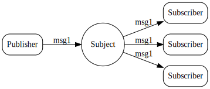

# 发布-订阅  
NATS实现了一个发布-订阅消息分发模型，用于一对多的通信。发布者发送有关主题的消息，监听该主题的任何活动订阅者都将接收该消息。订阅者也可以订阅通配符主题，工作方式有点像正则表达式(但只有一点)。这种一对多模式有时称为fan-out模式。  

# 消息  
消息由以下部分组成：  
1. 主题  
2. 字节数组形式的有效负载。  
3. 任意数量的报头字段。  
4. 一个可选的“回复”地址字段。

消息有一个最大负载大小设置(在服务器配置中使用' max_payload '设置)，默认设置为1 MB，但如果需要，可以增加到64 MB(尽管我们建议保持最大消息大小为更合理的8 MB)。