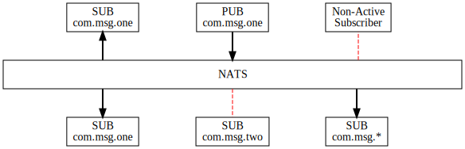

# NATS 发布/订阅 演练
NATS 是一个基于主题的发布订阅[publish subscribe](pubsub.md)消息系统[based on subjects](../../subjects.md)。 订阅某个主题的订阅者会收到发布在该主题上的消息。如果订阅者没有主动订阅主题，则不会收到消息。订阅者可以使用通配符标记（例如 * 和 >）来匹配单个标记或匹配主题的尾部。



### 演练先决条件
如果你还没有这样做, 你需要在你的机器上安装  [install](../../what-is-nats/walkthrough_setup.md) `nats` CLI 工具和可选的 nats-server。
## 1. 创建订阅者 1
在 shell 或命令提示符会话中，启动客户端订阅程序。

```bash
nats sub <subject>
```

在这里，`<subject>` 是要监听的主题。它有助于使用独特且经过深思熟虑的主题字符串，因为即使使用通配符，你也需要确保消息到达正确的订阅者。

例如:

```bash
nats sub msg.test
```

你应该会看到消息: _Listening on \[msg.test\]_

## 2. 创建发布者  
在另一个 shell 或命令提示符中，创建 NATS 发布者并发送消息。

```bash
nats pub <subject> <message>
```

其中`<subject>`是主题名称，`<message>`是要发布的文本。   
例如:

```bash
nats pub msg.test hello
```

## 3. 验证消息的发布和接收

你会注意到发布者发送了消息并打印: _Published \[msg.test\]:'NATS MESSAGE'_  
订阅者接收消息并打印：_\[\#1\] Received on \[msg.test\]: 'NATS MESSAGE'_  
如果接收者没有收到消息，则需要检查发布者和订阅者是否使用了相同的主题名称。  

## 4. 尝试发布另一条消息

```bash
nats pub msg.test "NATS MESSAGE 2"
```

你将注意到订阅者收到消息。
请注意，每次订阅客户端接收到有关该主题的消息时，消息计数都会增加。 

## 5. 创建订阅者 2
在新的shell或命令提示符中，启动一个新的NATS订阅服务器。  

```bash
nats sub msg.test
```

## 6. 使用发布者客户端发布另一条消息

```bash
nats pub msg.test "NATS MESSAGE 3"
```

验证两个订阅客户端都收到了消息。  

## 7. 创建订阅者 3
在新的shell或命令提示会话中，创建侦听不同主题的新订阅者。  

```bash
nats sub msg.test.new
```
订阅服务器1和订阅服务器2收到消息，但是订阅服务器3没有。为什么?因为订阅服务器3没有侦听发布者使用的消息主题。  

## 8. 更改订阅服务器3以使用通配符
将最后一个订阅者更改为在msg上侦听。*并运行它:

```bash
nats sub msg.*
```

注意:NATS只支持对消息订阅者使用通配符。你不能使用通配符主题发布消息。

## 9. 发布另一个消息

这一次，所有三个订阅客户端都应该收到消息。
请多尝试一些子字符串和通配符的变体，以测试你的理解能力。


# 请参见

使用NATS CLI发布-订阅模式  


Publish-subscribe pattern - NATS CLI

