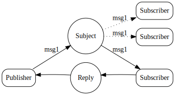

# Request-Reply

请求-回复是现代分布式系统中的一种常见模式。发送请求后，应用程序要么以一定的超时等待响应，要么以异步方式接收响应。

现代系统复杂性的增加需要位置透明度、放大和缩小、可观察性（根据系统生成的数据测量系统状态）等功能。 为了实现这个功能集，需要各种其他技术来整合额外的组件、sidecars（支持主要应用程序的进程或服务）和代理。另一方面，NATS 更容易实现 Request-Reply。

## NATS使Request-Reply简单而强大
- NATS 使用其核心通信机制（发布和订阅）支持请求-回复模式。使用回复主题在给定主题上发布请求。响应者侦听该主题并向回复主题发送响应。回复主题称为“inbox（收件箱）”。这些是动态定向回请求者的独特主题，而与任何一方的位置无关。  
- 多个 NATS 响应者可以形成动态队列组。因此，无需手动从组中添加或删除订阅者即可开始或停止分发消息。它是自动完成的。这允许响应者根据需要扩大或缩小规模。  
- NATS 应用程序“在退出前耗尽消息”（在关闭连接之前处理缓冲的消息）。这允许应用程序在不丢弃请求的情况下缩小规模。
- 由于 NATS 基于发布-订阅，因此可观察性就像运行另一个应用程序一样简单，该应用程序可以查看请求和响应以测量延迟、监视异常、直接可扩展性等等。
- NATS 的强大功能甚至允许多个响应，其中第一个响应被利用，系统有效地丢弃其他响应。这允许一个复杂的模式有多个响应者，减少响应延迟和抖动。

## 关联  

Try NATS request-reply on your own, using a live server by walking through the [request/reply walkthrough.](reqreply_walkthrough.md)
