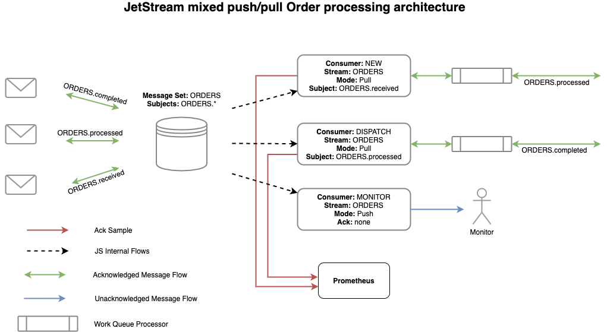

# Streams

流是“消息存储”，每个流定义了消息如何存储以及保留的限制(持续时间、大小、兴趣（流存在消费者及长期维持）)。流使用常规的NATS主题，在这些主题上发布的任何消息都能在jetstream流定义的存储系统（file、memory）中获取。对于不需要做消息确认的消息投递，您可以对subject做普通的发布，不过建议使用JetStream发布消息，因为JetStream服务器将回复一个确认信息（ack），确认已成功存储。

在上图中，我们展示了将所有 ORDERS.* 存储在 Stream 中的概念，即使有许多类型的订单相关消息。稍后我们将展示如何选择性地使用消息子集。相对而言，Stream 是最消耗资源的组件，因此能够以这种方式组合相关数据是非常重要的。  

流可以消费很多主题。这里我们用的是 ORDERS.*  但如果有必要的话，我们也可以将 SHIPPING.state 消费到同一个 Stream 中。   

流支持各种保存策略 —— 可以基于最大消息数量、流大小或最大时长等限制来保留，但也可以采用更有意思的策略，如只要任何消费者存在就保留stream，或者类似于工作队列的方式，stream在获得消费者ack后删除消息。

流支持使用 `Nats-Msg-Id` 标头和用于跟踪滑动窗口中重复消息的重复数据删除。请参阅消息重复数据删除部分。

当定义Streams时，整个配置由以下配置项组成：

| Item | Description |
| :--- | :--- |
| Name | 流的名称，不能有空格、制表符、句点(.)、大于(>)或星号(*)。看到命名。|
| Storage | 数据存储类型为`File` 和 `Memory`。 |
| Subjects | 要消费的主题列表，支持通配符。 |
| Replicas | 在集群JetStream中，每个消息要保留多少副本，最多5份。|
| MaxAge | 流中任何消息的最大时间，以纳秒（ns）为单位。 |
| MaxBytes | 流可能包含多少字节。遵循丢弃策略，如果流超过此字节数，则删除旧消息或拒绝新消息。 |
| MaxMsgs | 流中可能有多少条消息。遵循丢弃策略，如果流超过此消息数，则删除旧消息或拒绝新消息 |
| MaxMsgSize | 流接受的单条消息最大大小 |
| MaxConsumers | 指定一个流可以定义多少个consumer， -1表示无限|
| NoAck | 禁用 确认流接收到的消息 |
| Retention | 指定流中消息的保存策略，`LimitsPolicy(默认)`，`InterestPolicy`或`WorkQueuePolicy`|
| Discard | 当一个流达到它的限制策略后，`DiscardNew`拒绝新消息，而`DiscardOld(默认)`删除旧消息 |
| Duplicates | 用于跟踪重复消息的窗口，以纳秒表示。 |

