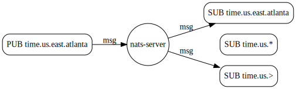

# 基于主题的消息传递

Fundamentally, NATS is about publishing and listening for messages. Both of these depend heavily on _Subjects_.  
基本上，NATS是关于发布和监听消息的。这两者都很大程度上依赖于 _主题（subjects）_。


**什么是主题?**  
最简单的来说，主题只是组成名称的一串字符，发布者和订阅者可以使用该名称找到彼此。它有助于将消息限定为流或主题。    


### 字符允许命名主题  

为了跨客户端的兼容性，我们建议使用 ASCII 字符（将来可能会更改）  

**推荐字符:** a ~ z、A ~ Z、0 ~ 9(名称区分大小写，不能包含空格)。  

**特殊字符:** 半角句号`.`(用于分隔主题中的标记)、`*`以及`>`(*和>用作通配符)  

## 主题层次结构  
`.`字符用于创建主题层次结构。例如，世界时钟应用程序可能会定义以下内容以对相关主题进行逻辑分组：  

```markup
time.us
time.us.east
time.us.east.atlanta
time.eu.east
time.eu.warsaw
```

## 通配符  

NATS提供了两个通配符，它们可以取代一个或多个以点分隔的主题中的元素。订阅者可以使用这些通配符监听单个订阅的多个主题，但发布者必须指定完整的主题名，而不能使用通配符。  

### 匹配单个主题标记  

第一个通配符是`*`，它将匹配单个标记。例如，如果应用程序想要监听东部时区，他们可以订阅`time.*.east`，这将匹配`time.us.east`和`time.eu.east`。


### 匹配多个主题标记  

第二个通配符是`>`，它将匹配一个或多个标记，并且只能出现在主题的末尾。例如，`time.us.>` 将匹配`time.us.east`和`time.us.east.atlanta`，而`time.us.*`将仅匹配`time.us.east`，因为它不能匹配多个标记。  

  

### 监控和窃听

根据你的安全配置，通配符可用于通过创建称为窃听器的东西进行监控。在最简单的情况下，你可以为`>`创建一个订阅者。此应用程序将接收在你的NATS集群上发送的所有消息(同样取决于安全设置)。  

### 混合通配符  
通配符`*`可以在同一个主题中出现多次。这两种类型都可以使用。例如,`*.* .east.>`将接收时间`time.us.east.atlanta`。

## 主题标记

建议将主题中的最大标记数保持在一个合理值，即最多16个标记。


