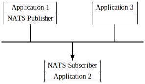

# NATS是什么

软件应用程序和服务需要交换数据。 NATS 是一种允许以消息形式进行数据交换的基础设施。我们称之为“面向消息的中间件”。  

使用 NATS，应用程序开发人员可以： 

- 轻松构建分布式和可伸缩的客户端-服务器应用程序。

- 以一般方式实时存储和分发数据。可以在各种环境、语言、云提供商和本地系统中灵活地实现。

### NATS客户端程序

开发人员在其应用程序代码中使用 NATS 客户端库，以允许他们在应用程序实例之间或完全独立的应用程序之间发布、订阅、请求和回复。在本手册中，这些应用程序通常称为“客户端应用程序”或有时仅称为“客户端”（因为从 NATS 服务器的角度来看，它们就是客户端）。 

### NATS服务基础架构  
 
NATS 服务由一个或多个 NATS 服务器进程提供，这些进程被配置为相互互连并提供 *NATS 服务基础*。 NATS 服务基础架构可以从运行在终端设备上的单个 NATS 服务器进程（`nats-server` 进程的大小小于 20 MB！）扩展成一个涵盖全球所有地区主要云提供商的公共的全球超级集群，例如 Synadia 的 NGS。  

### 将NATS客户端应用程序连接到NATS服务器

将NATS客户端应用程序与NATS服务连接，然后向主题订阅或发布消息，只需要配置：

1. **URL:** ['NATS URL'](/using-nats/developing-with-nats/connecting/README.md#nats-url)这是一个字符串（以 URL 格式），指定可以访问 NATS 服务器的 IP 地址和端口，以及要建立的连接类型（普通 TCP、TLS 或 Websocket）。

2.  **Authentication** (如需要): 应用程序的身份验证详细信息，用于向 NATS 服务器标识自己。 NATS 支持多种身份验证方案（用户名/密码、去中心化的JWT、token、TLS 证书和具有应答的 Nkey）。

## 简单的消息传递设计

NATS使得应用程序通过发送和接收消息进行通信变得很容易。这些消息由主题字符串寻址和标识，不依赖于网络位置。

数据被编码和框架化为消息并由发布者发送。消息由一个或多个订阅者接收、解码和处理。

通过这种简单的设计，NATS允许程序共享公共的消息处理代码、隔离资源和相互依赖，并通过轻松地处理消息量的增加来扩展，无论这些消息量是服务请求还是流数据。

### NATS服务质量(QoS)

NATS 提供多种服务质量，具体取决于应用程序是仅使用NATS核心功能还是使用NATS JetStream 的附加功能（JetStream 内置在 `nats-server` 中，但可能不会在所有服务基础设施上启用）。

- **At most once QoS:** _Core NATS_ 提供**最多一次**的服务质量。如果订阅者没有监听主题（没有主题匹配），或者在发送消息时未处于活动状态，则不会收到消息。这与 TCP/IP 提供的保证级别相同。 Core NATS 是一个即发即弃的消息传递系统。它只会将消息保存在内存中，并且永远不会将消息直接写入磁盘。

- **At-least / exactly once QoS:** 如果您需要更高质量的服务（**至少一次**或**恰好一次**），或持久流、解耦流控制和键/值存储等功能，您可以使用[NATS JetStream](/nats-concepts/jetstream/readme.md)，它内置在NATS服务器中（但需要启用）。当然，您还可以使用经过验证的、可伸缩的参考设计(如acks和序列号)，自己为客户端应用程序构建额外的可靠性。

